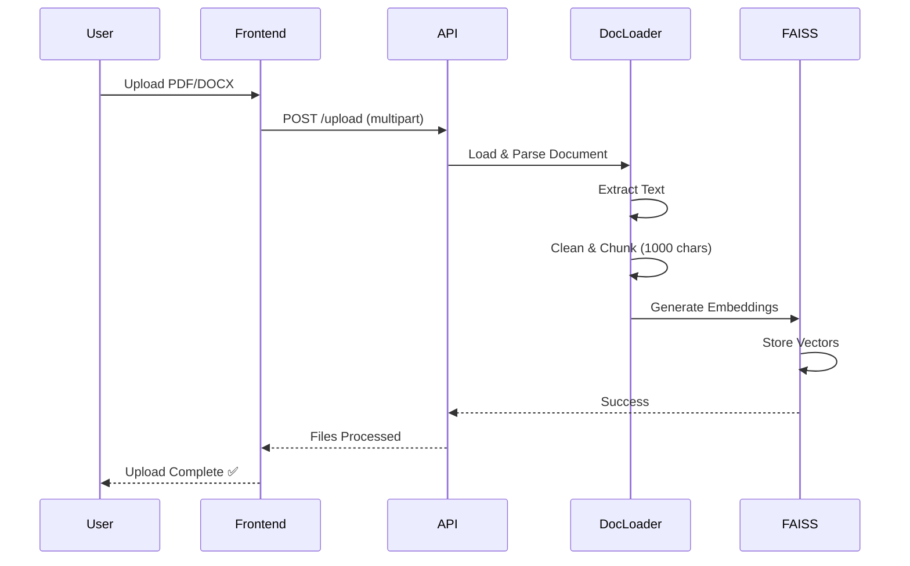
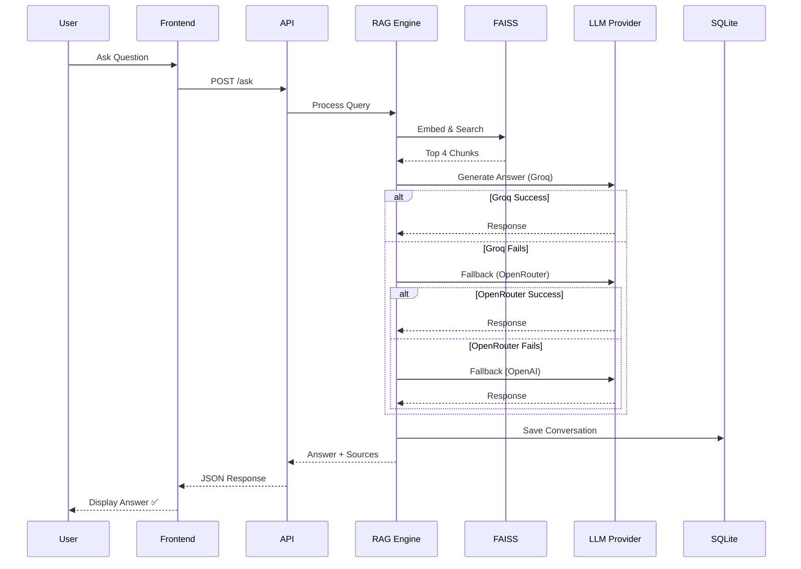

<div align="center">

# 🧠 DocuMind — AI RAG Chat System

### Enterprise-grade Retrieval-Augmented Generation (RAG) system with multi-LLM support

**Chat with your documents using AI • Get answers with source citations • Multi-provider fallback**

[](https://www.python.org/downloads/)
[](https://fastapi.tiangolo.com/)
[](https://streamlit.io/)
[](https://opensource.org/licenses/MIT)
[](https://github.com/Baisampayan1324/DocuMind)

[Features](#-features) • [Quick Start](#-quick-start) • [Documentation](#-documentation) • [Architecture](#-architecture) • [Contributing](#-contributing)

</div>

---

## 📋 Table of Contents

- [Overview](#-overview)
- [Quick Start](#-quick-start)
- [Features](#-features)
- [Architecture](#-architecture)
- [Project Structure](#-project-structure)
- [How It Works](#-how-it-works)
- [Configuration](#-configuration)
- [Usage](#-usage)
- [Documentation](#-documentation)
- [Tech Stack](#-tech-stack)
- [Development](#-development)

---

## 🌟 Overview

**DocuMind** is a production-ready **Retrieval-Augmented Generation (RAG)** system that transforms how you interact with your documents. Upload PDFs, Word documents, PowerPoint presentations, or text files, and ask questions in natural language—the AI will provide accurate answers with **source citations** from your documents.

### ⚡ Why DocuMind?

<table>
<tr>
<td width="50%">

**🎯 Intelligent & Accurate**
- Multi-LLM support (Groq, OpenRouter, OpenAI)
- Automatic provider fallback for 99.9% uptime
- FAISS-powered semantic search
- Source citations for every answer

</td>
<td width="50%">

**🚀 Production-Ready**
- FastAPI REST API with auto-generated docs
- SQLite persistence with full history
- Analytics dashboard with usage insights
- Horizontal scaling ready

</td>
</tr>
<tr>
<td width="50%">

**📄 Universal Document Support**
- PDF, DOCX, PPTX, TXT processing
- Intelligent text chunking
- Metadata preservation
- Batch upload support

</td>
<td width="50%">

**🛠️ Developer-Friendly**
- One-command startup (`python main.py`)
- Comprehensive API documentation
- React/Vue/Angular integration ready
- Docker deployment ready

</td>
</tr>
</table>

---

## 🚀 Quick Start

Get up and running in 3 minutes:

### 📋 Prerequisites

- Python 3.9 or higher
- At least **one** API key (Groq recommended—it's FREE!)
- 4GB RAM minimum

### 🔧 Installation

```bash
# 1. Clone the repository
git clone https://github.com/Baisampayan1324/DocuMind.git
cd DocuMind

# 2. Create virtual environment (recommended)
python -m venv .venv

# Activate venv:
# Windows PowerShell:
.venv\Scripts\Activate.ps1
# Windows CMD:
.venv\Scripts\activate.bat
# Linux/macOS:
source .venv/bin/activate

# 3. Install dependencies
pip install -r requirements.txt

# 4. Configure API keys
copy .env.template .env  # Windows
# OR
cp .env.template .env    # Linux/macOS

# Edit .env and add at least one API key
```

### 🔑 Get Your API Keys (Choose One)

<details>
<summary><b>🚀 Groq (Recommended - FREE & FAST)</b></summary>

1. Visit [console.groq.com](https://console.groq.com)
2. Sign up (no credit card required)
3. Navigate to API Keys
4. Create new key
5. Add to `.env`: `GROQ_API_KEY=gsk_...`

**Why Groq?** ⚡ Lightning fast • 🆓 Completely free • 🤖 Llama 3.1 models
</details>

<details>
<summary><b>🌐 OpenRouter (Alternative - FREE tier)</b></summary>

1. Visit [openrouter.ai](https://openrouter.ai)
2. Sign up for account
3. Go to Keys section
4. Create API key
5. Add to `.env`: `OPENROUTER_API_KEY=sk-or-...`

**Why OpenRouter?** 🎯 100+ models • 🆓 Free tier available • 💰 Pay-per-use
</details>

<details>
<summary><b>🤖 OpenAI (Fallback - PAID)</b></summary>

1. Visit [platform.openai.com](https://platform.openai.com)
2. Sign up and add payment method
3. Navigate to API Keys
4. Create secret key
5. Add to `.env`: `OPENAI_API_KEY=sk-...`

**Why OpenAI?** 🏆 Highest quality • 🧠 GPT-4 available • 💳 Requires payment
</details>

### ▶️ Run the Application

```bash
python main.py
```

**That's it!** The launcher will:
- ✅ Check dependencies
- ✅ Validate configuration
- ✅ Start backend API (port 8000)
- ✅ Start frontend UI (port 8501)
- ✅ Open your browser automatically

🌐 **Access the app:** http://localhost:8501

---

### 🎯 First Steps

1. **Upload Documents**: Click "Browse files" → Select PDF/DOCX/PPTX/TXT → Click "Upload"
2. **Ask Questions**: Type your question in the chat input → Press Enter
3. **View Sources**: Expand the "📄 Sources" section to see citations
4. **Check Analytics**: Run `streamlit run frontend/admin.py --server.port 8502` for dashboard

---

## ✨ Features

### 🤖 Multi-LLM Intelligence

<table>
<tr>
<td width="33%">

**Groq**
- ⚡ Lightning-fast inference
- 🆓 Free tier (no credit card)
- 🦙 Llama 3.1 models
- Primary provider

</td>
<td width="33%">

**OpenRouter**
- 🎯 100+ model access
- 💰 Pay-per-use pricing
- 🔄 Unified API
- Automatic fallback

</td>
<td width="33%">

**OpenAI**
- 🏆 GPT-4 quality
- 🧠 Industry standard
- 📊 Reliable uptime
- Final fallback

</td>
</tr>
</table>

**Automatic Failover**: If one provider fails, DocuMind seamlessly switches to the next—ensuring 99.9% uptime.

---

### 📄 Universal Document Processing

| Format | Support | Features |
|--------|---------|----------|
| **PDF** | ✅ Full | Text extraction, multi-page, embedded fonts |
| **DOCX** | ✅ Full | Styles, tables, headers/footers |
| **PPTX** | ✅ Full | Slide text, notes, shapes |
| **TXT** | ✅ Full | UTF-8, multiple encodings |

**Smart Chunking**: Documents are split into 1000-character chunks with 200-character overlap to preserve context while optimizing retrieval.

---

### 🔍 Intelligent Retrieval


- **Semantic Search**: FAISS vector database finds contextually relevant chunks
- **HuggingFace Embeddings**: `all-MiniLM-L6-v2` model (384 dimensions)
- **Top-K Retrieval**: Returns 4 most relevant passages by default
- **Source Attribution**: Every answer links back to source documents

---

### � Analytics & Monitoring

Built-in admin dashboard provides:

- 📈 Conversation history with full search
- 📊 Provider usage statistics (pie charts)
- 🤖 Model distribution analysis
- 📅 Time-based filtering
- 📥 CSV export for external analysis
- 🔍 Question/answer search

**Access**: `streamlit run frontend/admin.py --server.port 8502`

---

### 🎯 Developer Features

- **REST API**: FastAPI with automatic OpenAPI docs (`/docs`, `/redoc`)
- **Async Support**: Non-blocking operations for high concurrency
- **Type Safety**: Pydantic models for request/response validation
- **Hot Reload**: Development mode with auto-restart on changes
- **Error Handling**: Comprehensive error messages and logging
- **CORS Enabled**: Ready for frontend integration

---

## 🏗️ Architecture

### 🎯 System Overview

```
┌─────────────────────────────────────────────────────────────────┐
│                    👤 User Interface Layer                       │
│                                                                  │
│   ┌──────────────────┐              ┌─────────────────┐        │
│   │  💬 Main Chat    │              │  📊 Analytics   │        │
│   │  (Port 8501)     │              │  (Port 8502)    │        │
│   └────────┬─────────┘              └────────┬────────┘        │
└────────────┼──────────────────────────────────┼─────────────────┘
             │                                  │
             │         REST API (HTTP)          │
             ▼                                  ▼
┌─────────────────────────────────────────────────────────────────┐
│                    ⚙️  FastAPI Backend (Port 8000)               │
│                                                                  │
│   ┌─────────────────────────────────────────────────────────┐  │
│   │                    🔌 API Routes                         │  │
│   │  /upload • /ask • /history • /stats • /health • /docs   │  │
│   └──────────────────────┬──────────────────────────────────┘  │
│                          │                                      │
│                          ▼                                      │
│   ┌─────────────────────────────────────────────────────────┐  │
│   │               🧠 RAG Engine (Core Logic)                 │  │
│   │                                                           │  │
│   │  ┌──────────┐   ┌───────────┐   ┌─────────────┐        │  │
│   │  │ Document │──▶│   FAISS   │──▶│ LLM Multi-  │        │  │
│   │  │  Loader  │   │  Vector   │   │  Provider   │        │  │
│   │  │          │   │  Store    │   │  Manager    │        │  │
│   │  └──────────┘   └───────────┘   └─────────────┘        │  │
│   └─────────────────────────────────────────────────────────┘  │
│                                                                  │
│   ┌─────────────────────────────────────────────────────────┐  │
│   │                   💾 Data Persistence                     │  │
│   │                                                           │  │
│   │   ┌─────────────────┐         ┌─────────────────┐       │  │
│   │   │ conversation_   │         │  faiss_index/   │       │  │
│   │   │  history.db     │         │  (Embeddings)   │       │  │
│   │   │  (SQLite)       │         │                 │       │  │
│   │   └─────────────────┘         └─────────────────┘       │  │
│   └─────────────────────────────────────────────────────────┘  │
└─────────────────────────────────────────────────────────────────┘
```

### 🔄 Request Flow

<details>
<summary><b>📤 Document Upload Flow</b></summary>



</details>

<details>
<summary><b>💬 Question-Answer Flow</b></summary>



</details>

---

## 📁 Project Structure

```
DocuMind/
│
├── 🚀 main.py                      # ⭐ START HERE - Unified launcher
├── 📦 requirements.txt             # Python dependencies
├── 🔐 .env                         # API keys (create from template)
├── 🔐 .env.template                # Configuration template
├── 📋 .gitignore                   # Git ignore rules
├── 📄 LICENSE                      # MIT License
│
├── ⚙️  backend/                    # FastAPI Backend (Port 8000)
│   ├── 📄 README.md                # 📖 Detailed backend documentation
│   ├── 🔌 api.py                   # REST API endpoints (8 routes)
│   ├── 🧠 rag_engine.py            # RAG pipeline orchestration
│   ├── 🤖 llm_provider.py          # Multi-LLM manager
│   ├── 📖 doc_loader.py            # Document processor
│   ├── 💾 history_db.py            # SQLite operations
│   ├── ⚙️  config.py                # Configuration loader
│   ├── 🗃️  models.py                # Database models
│   │
│   └── � data/                    # Runtime data (auto-generated)
│       ├── conversation_history.db # SQLite database
│       └── faiss_index/            # Vector embeddings
│           ├── index.faiss
│           └── index.pkl
│
├── 🖥️  frontend/                   # Streamlit UI
│   ├── 📄 README.md                # 📖 Detailed frontend documentation
│   ├── 💬 app_api.py               # Main chat interface (Port 8501)
│   └── 📊 admin.py                 # Analytics dashboard (Port 8502)
│
├── 📚 docs/                        # Documentation
│   ├── 🚀 QUICK_START.md
│   ├── 🏗️  ARCHITECTURE.md
│   ├── 🔌 FASTAPI_QUICK_REFERENCE.md
│   ├── 🚢 DEPLOYMENT.md
│   └── ⚙️  FASTAPI_SETUP_GUIDE.md
│
├── 🧪 .github/                     # GitHub Actions
│   └── workflows/
│       └── python-ci.yml           # CI/CD pipeline
│
└── 📦 archive/                     # Historical files
    ├── deprecated/
    ├── phase2_planning/
    ├── implementation/
    ├── fixes/
    └── test/
```

### 🗂️ Key Files

| File | Purpose | Priority |
|------|---------|----------|
| `main.py` | **Unified launcher** - Start backend + frontend | ⭐⭐⭐ |
| `backend/README.md` | Complete backend architecture docs | ⭐⭐⭐ |
| `frontend/README.md` | Complete frontend architecture docs | ⭐⭐⭐ |
| `backend/api.py` | REST API endpoint definitions | ⭐⭐ |
| `backend/rag_engine.py` | Core RAG pipeline logic | ⭐⭐ |
| `backend/config.py` | Environment configuration | ⭐⭐ |
| `.env` | API keys and secrets | ⭐⭐⭐ |

### Key Files Explained

| File | Purpose | When to Use |
|------|---------|-------------|
| `main.py` | **Unified launcher** - Starts both backend + frontend | **Run this to start everything** |
| `backend/README.md` | **Detailed backend architecture** - How RAG works, data flow, API details | **Read this to understand backend** |
| `frontend/README.md` | **Detailed frontend architecture** - UI components, API integration | **Read this to understand frontend** |
| `backend/config.py` | **Configuration manager** - Loads .env, validates settings | **Modify to change defaults** |
| `backend/data/conversation_history.db` | **SQLite database** - All conversation history | **Query this for analytics** |
| `backend/data/faiss_index/` | **Vector database** - Document embeddings | **Delete to reindex documents** |
| `.env` | **Sensitive config** - API keys, secrets | **Create from .env.template** |

---

## 🔍 How It Works

### 1. Document Upload Process

**User Perspective:**
1. Upload PDF/DOCX/PPTX/TXT files via Streamlit UI
2. Click "Upload Documents"
3. See success message with file count

**Behind the Scenes:**

```python
# 1. Frontend sends files to backend
POST http://localhost:8000/upload
Content-Type: multipart/form-data
files: [file1.pdf, file2.docx]

# 2. Backend processes each file
for file in uploaded_files:
    # a. Save to temp folder
    temp_path = save_temp_file(file)
    
    # b. Load document (detect format, extract text)
    text = UniversalDocLoader.load_document(temp_path)
    
    # c. Clean text (remove extra spaces, fix line breaks)
    clean_text = UniversalDocLoader.clean_text(text)
    
    # d. Chunk text (1000 chars, 200 overlap)
    chunks = UniversalDocLoader.chunk_text(clean_text, metadata={"source": file.name})
    
    # e. Generate embeddings (HuggingFace model)
    embeddings = HuggingFaceEmbeddings("all-MiniLM-L6-v2")
    vectors = embeddings.embed_documents([chunk.page_content for chunk in chunks])
    
    # f. Store in FAISS vector database
    vectorstore.add_documents(chunks)
    
    # g. Save FAISS index to disk (if PERSIST_FAISS=true)
    vectorstore.save_local("backend/data/faiss_index")
    
    # h. Delete temp file
    os.remove(temp_path)

# 3. Return success response
{"status": "success", "files_processed": ["file1.pdf", "file2.docx"]}
```

**Why Chunking?**
- LLMs have token limits (can't process entire documents)
- Smaller chunks = more precise retrieval
- Overlap ensures context isn't lost at chunk boundaries

### 2. Question-Answer Process

**User Perspective:**
1. Type question in chat input
2. Press Enter
3. See AI answer with source citations

**Behind the Scenes:**

```python
# 1. Frontend sends question to backend
POST http://localhost:8000/ask
{
    "question": "What is the main topic of the document?",
    "provider": "groq"  # optional
}

# 2. Backend RAG pipeline
def query_async(question):
    # a. Embed the question
    question_vector = embeddings.embed_query(question)
    
    # b. Search FAISS for similar chunks (Top 4)
    similar_chunks = vectorstore.similarity_search(question, k=4)
    
    # c. Build prompt with context
    context = "\n\n".join([chunk.page_content for chunk in similar_chunks])
    prompt = f"""Based on the following context, answer the question.
    
Context:
{context}

Question: {question}

Answer:"""
    
    # d. Call LLM (try Groq, fallback to OpenRouter, then OpenAI)
    try:
        llm = llm_provider.get_llm("groq")
        response = llm.invoke(prompt)
    except:
        try:
            llm = llm_provider.get_llm("openrouter")
            response = llm.invoke(prompt)
        except:
            llm = llm_provider.get_llm("openai")
            response = llm.invoke(prompt)
    
    # e. Extract sources from chunks
    sources = [
        {
            "source": chunk.metadata["source"],
            "chunk_id": chunk.metadata["chunk_id"],
            "content": chunk.page_content[:200]  # First 200 chars
        }
        for chunk in similar_chunks
    ]
    
    # f. Save to database
    history_db.save_conversation(
        question=question,
        answer=response.content,
        sources=sources,
        provider_used="groq",
        model_used="llama-3.1-8b-instant"
    )
    
    # g. Return response
    return {
        "answer": response.content,
        "sources": sources,
        "provider_used": "groq",
        "model_used": "llama-3.1-8b-instant"
    }

# 3. Frontend displays answer with sources
```

**Why Multi-LLM?**
- **Reliability**: If one provider is down, others work
- **Cost Optimization**: Use free Groq first, paid OpenAI as fallback
- **Flexibility**: Easy to switch providers without code changes

### 3. Database Storage

**Why SQLite?**
- ✅ **No separate database server** - Embedded in application
- ✅ **ACID compliant** - Transactional integrity
- ✅ **Easy to query** - Standard SQL
- ✅ **Perfect for analytics** - Admin dashboard queries this
- ✅ **Portable** - Single file, easy to backup

**Schema:**
```sql
CREATE TABLE conversations (
    id INTEGER PRIMARY KEY AUTOINCREMENT,
    timestamp TEXT NOT NULL,
    question TEXT NOT NULL,
    answer TEXT NOT NULL,
    sources TEXT,           -- JSON array
    provider_used TEXT,
    model_used TEXT
);
```

**Location:** `backend/data/conversation_history.db`

**Queried By:** Admin dashboard for analytics

---

## 🔧 Configuration

### Environment Variables (.env)

Create `.env` file from template:
```bash
cp .env.template .env
```

**Required Settings:**
```env
# API Keys - At least ONE required
GROQ_API_KEY=gsk_xxxxxxxxxxxxx              # Get from https://console.groq.com
OPENROUTER_API_KEY=sk-or-xxxxxxxxxxxxx      # Get from https://openrouter.ai
OPENAI_API_KEY=sk-xxxxxxxxxxxxx             # Get from https://platform.openai.com
```

**Optional Settings:**
```env
# Model Selection (defaults shown)
GROQ_MODEL=llama-3.1-8b-instant
OPENROUTER_MODEL=meta-llama/llama-3.3-8b-instruct:free
OPENAI_MODEL=gpt-4o-mini

# Chunking Parameters
CHUNK_SIZE=1000          # Characters per chunk
CHUNK_OVERLAP=200        # Overlap between chunks

# Retrieval
TOP_K_CHUNKS=4           # Number of chunks to retrieve

# Embedding Model
EMBEDDING_MODEL=sentence-transformers/all-MiniLM-L6-v2

# Storage Paths
FAISS_PERSIST_DIR=data/faiss_index
HISTORY_DB_PATH=data/conversation_history.db

# Persistence
PERSIST_FAISS=true       # Save FAISS index to disk

# Provider Priority (fallback order)
PROVIDER_PRIORITY=groq,openrouter,openai
```

### API Keys - How to Get Them

#### Groq (Recommended - FREE & FAST)
1. Visit https://console.groq.com
2. Sign up for free account
3. Go to API Keys section
4. Create new API key
5. Copy key to `.env` as `GROQ_API_KEY`

**Why Groq?**
- ✅ FREE (no credit card required)
- ✅ FAST (optimized inference)
- ✅ Good quality (Llama 3.1)

#### OpenRouter (Alternative - FREE tier available)
1. Visit https://openrouter.ai
2. Sign up for account
3. Go to Keys section
4. Create new API key
5. Copy key to `.env` as `OPENROUTER_API_KEY`

**Why OpenRouter?**
- ✅ Access to 100+ models
- ✅ FREE tier available
- ✅ Pay only for what you use

#### OpenAI (Fallback - PAID)
1. Visit https://platform.openai.com
2. Sign up for account
3. Add payment method
4. Go to API Keys
5. Create new secret key
6. Copy key to `.env` as `OPENAI_API_KEY`

**When to use OpenAI?**
- Need highest quality responses
- Have existing OpenAI credits
- Primary providers are down

---

## 🎮 Usage

### 🚀 Method 1: Unified Launcher (Recommended)

```bash
python main.py
```

**What happens automatically:**
- ✅ Dependency validation
- ✅ Configuration check (.env)
- ✅ Backend startup (port 8000)
- ✅ Frontend startup (port 8501)
- ✅ Browser auto-launch

**Access Points:**
- 💬 **Main UI**: http://localhost:8501
- 🔌 **Backend API**: http://localhost:8000
- 📖 **API Docs**: http://localhost:8000/docs (Swagger UI)
- 📊 **Admin Dashboard**: Run separately (see below)

---

### 🔧 Method 2: Manual Start (Advanced)

<details>
<summary><b>Start Services Individually</b></summary>

**Terminal 1 - Backend:**
```bash
uvicorn backend.api:app --reload --host 0.0.0.0 --port 8000
```

**Terminal 2 - Frontend:**
```bash
streamlit run frontend/app_api.py --server.port 8501
```

**Terminal 3 - Admin Dashboard (Optional):**
```bash
streamlit run frontend/admin.py --server.port 8502
```

</details>

---

### 💬 Using the Main UI

#### 1️⃣ Upload Documents

1. Click **"Browse files"** in the sidebar
2. Select PDF, DOCX, PPTX, or TXT files
3. Upload multiple files at once ✅
4. Click **"Upload Documents"**
5. Wait for success confirmation

#### 2️⃣ Ask Questions

1. Type your question in the chat input
2. Press **Enter** or click send
3. View AI-generated answer
4. See source citations automatically

#### 3️⃣ View Sources

- Click **"📄 Sources"** expander
- See document references
- View exact text excerpts
- Check chunk IDs for traceability

#### 4️⃣ Clear History

- Click **"🗑️ Clear History"** in sidebar
- Confirmation prompt appears
- Clears UI chat and backend history

---

### 📊 Admin Dashboard

```bash
streamlit run frontend/admin.py --server.port 8502
```

**Access:** http://localhost:8502

**Capabilities:**
- 📋 Full conversation history table
- 📊 Provider usage pie charts
- 📈 Model distribution bar charts
- 🔍 Search conversations by keyword
- 📅 Filter by date range
- 📥 Export to CSV

---

### 🔌 REST API Usage

**Interactive Documentation:**
- **Swagger UI**: http://localhost:8000/docs
- **ReDoc**: http://localhost:8000/redoc

**Example cURL Commands:**

```bash
# Health check
curl http://localhost:8000/health

# Upload document
curl -X POST "http://localhost:8000/upload" \
  -F "files=@document.pdf" \
  -F "files=@report.docx"

# Ask question
curl -X POST "http://localhost:8000/ask" \
  -H "Content-Type: application/json" \
  -d '{
    "question": "What is RAG?",
    "provider": "groq"
  }'

# Get conversation history
curl http://localhost:8000/history?limit=10

# Get provider statistics
curl http://localhost:8000/stats

# Clear history
curl -X POST http://localhost:8000/clear-history
```

**Python Example:**

```python
import requests

# Upload document
with open("document.pdf", "rb") as f:
    response = requests.post(
        "http://localhost:8000/upload",
        files={"files": f}
    )
print(response.json())

# Ask question
response = requests.post(
    "http://localhost:8000/ask",
    json={"question": "Summarize the main points", "provider": "groq"}
)
print(response.json()["answer"])
```

---

## 📖 Documentation

| Document | Description | When to Read |
|----------|-------------|--------------|
| **[backend/README.md](backend/README.md)** | **Complete backend architecture** - How RAG works, data flow, API details, troubleshooting | **MUST READ** to understand system |
| **[frontend/README.md](frontend/README.md)** | **Complete frontend architecture** - UI components, API integration, session management | **MUST READ** for frontend dev |
| [docs/QUICK_START.md](docs/QUICK_START.md) | Quick 3-step setup guide | First-time setup |
| [docs/ARCHITECTURE.md](docs/ARCHITECTURE.md) | High-level system design | Understanding system |
| [docs/FASTAPI_QUICK_REFERENCE.md](docs/FASTAPI_QUICK_REFERENCE.md) | API endpoint reference | API integration |
| [docs/DEPLOYMENT.md](docs/DEPLOYMENT.md) | Production deployment guide | Going to production |

**⭐ Most Important:** 
- `backend/README.md` - Explains **how the RAG system works internally**
- `frontend/README.md` - Explains **how the UI communicates with backend**

---

## 📊 Tech Stack

### Backend

| Technology | Version | Purpose |
|-----------|---------|---------|
| **FastAPI** | 0.100+ | REST API framework - async, fast, auto-docs |
| **Uvicorn** | Latest | ASGI server for FastAPI |
| **LangChain** | Latest | RAG framework - chunking, prompts, chains |
| **FAISS** | CPU | Vector database - fast similarity search |
| **HuggingFace** | Latest | Embeddings model (all-MiniLM-L6-v2) |
| **SQLite** | 3.x | Conversation history database |
| **SQLAlchemy** | 2.x | ORM for database operations |
| **Pydantic** | 2.x | Data validation and settings |
| **Python-dotenv** | Latest | Environment variable loading |

### LLM Providers

| Provider | Library | Purpose |
|----------|---------|---------|
| **Groq** | langchain-groq | Primary LLM (fast, free) |
| **OpenRouter** | langchain-openai | Fallback LLM (100+ models) |
| **OpenAI** | langchain-openai | Secondary fallback (high quality) |

### Document Processing

| Library | Purpose |
|---------|---------|
| **PyPDF2** | PDF text extraction |
| **python-docx** | Word document processing |
| **python-pptx** | PowerPoint processing |

### Frontend

| Technology | Purpose |
|-----------|---------|
| **Streamlit** | Web UI framework |
| **Requests** | HTTP client for API calls |
| **Pandas** | Data manipulation (admin dashboard) |
| **Plotly** | Charts and visualizations |

---

## 🛠️ Development

### Project Setup

```bash
# Clone repository
git clone <repository-url>
cd RAG

# Create virtual environment (recommended)
python -m venv venv
source venv/bin/activate  # On Windows: venv\Scripts\activate

# Install dependencies
pip install -r requirements.txt

# Setup pre-commit hooks (optional)
pip install pre-commit
pre-commit install
```

### Running Tests

```bash
# Run all tests
python -m pytest tests/

# Run with coverage
python -m pytest --cov=backend --cov=frontend tests/

# Run specific test file
python -m pytest tests/test_rag_engine.py
```

### Code Quality

```bash
# Format code
black backend/ frontend/

# Lint code
flake8 backend/ frontend/

# Type checking
mypy backend/ frontend/
```

### Adding New Features

**1. New API Endpoint:**
```python
# backend/api.py

@app.post("/new-endpoint")
async def new_feature(data: RequestModel):
    # Your code here
    return {"status": "success"}
```

**2. New Document Format:**
```python
# backend/doc_loader.py

@staticmethod
def _load_new_format(path: str) -> str:
    # Load and return text
    return extracted_text
```

**3. New LLM Provider:**
```python
# backend/llm_provider.py

if Config.NEW_PROVIDER_API_KEY:
    try:
        self.providers["new_provider"] = NewProviderChat(
            model=Config.NEW_PROVIDER_MODEL
        )
    except Exception as e:
        logger.warning(f"New provider init failed: {e}")
```

### Debugging

**Enable Debug Logging:**
```python
# backend/config.py

import logging
logging.basicConfig(level=logging.DEBUG)
```

**Check Backend Logs:**
```bash
# Terminal running uvicorn will show logs
# Look for ERROR or WARNING messages
```

**Check Database:**
```bash
# Open SQLite database
sqlite3 backend/data/conversation_history.db

# View conversations
SELECT * FROM conversations ORDER BY timestamp DESC LIMIT 10;

# Count conversations
SELECT COUNT(*) FROM conversations;
```

**Inspect FAISS Index:**
```python
# Python console
from langchain_community.vectorstores import FAISS
from langchain_community.embeddings import HuggingFaceEmbeddings

embeddings = HuggingFaceEmbeddings()
vectorstore = FAISS.load_local("backend/data/faiss_index", embeddings)

# Check number of vectors
print(vectorstore.index.ntotal)
```

---

## 🚀 Deployment

See **[docs/DEPLOYMENT.md](docs/DEPLOYMENT.md)** for comprehensive production deployment guide.

### 🐳 Docker Deployment (Recommended)

<details>
<summary><b>Docker Setup</b></summary>

**Create Dockerfile:**

```dockerfile
FROM python:3.9-slim

WORKDIR /app

# Install dependencies
COPY requirements.txt .
RUN pip install --no-cache-dir -r requirements.txt

# Copy application
COPY . .

# Expose ports
EXPOSE 8000 8501

# Run application
CMD ["python", "main.py"]
```

**Build and Run:**

```bash
# Build image
docker build -t documind:latest .

# Run container
docker run -d \
  --name documind \
  -p 8000:8000 \
  -p 8501:8501 \
  --env-file .env \
  -v $(pwd)/backend/data:/app/backend/data \
  documind:latest
```

**Docker Compose:**

```yaml
version: '3.8'

services:
  documind:
    build: .
    ports:
      - "8000:8000"
      - "8501:8501"
    env_file:
      - .env
    volumes:
      - ./backend/data:/app/backend/data
    restart: unless-stopped
```

```bash
docker-compose up -d
```

</details>

---

### ☁️ Cloud Platforms

<details>
<summary><b>Railway</b></summary>

1. Connect GitHub repository
2. Add environment variables in dashboard
3. Deploy automatically on push
4. Custom domain support available

[Deploy to Railway →](https://railway.app)

</details>

<details>
<summary><b>Render</b></summary>

1. Create new Web Service
2. Connect repository
3. Set build command: `pip install -r requirements.txt`
4. Set start command: `python main.py`
5. Add environment variables

[Deploy to Render →](https://render.com)

</details>

<details>
<summary><b>Heroku</b></summary>

```bash
# Install Heroku CLI
heroku login

# Create app
heroku create documind-app

# Set environment variables
heroku config:set GROQ_API_KEY=your_key

# Deploy
git push heroku main
```

</details>

---

### 🔒 Production Checklist

- [ ] Set strong API keys
- [ ] Enable HTTPS/SSL
- [ ] Configure CORS properly
- [ ] Set up monitoring (health checks)
- [ ] Configure backups for SQLite DB
- [ ] Set rate limiting on API
- [ ] Add authentication/authorization
- [ ] Configure logging (production level)
- [ ] Set up error tracking (Sentry)
- [ ] Use environment-specific configs

---

---

<div align="center">

## 🔮 Roadmap

| Feature | Status | Priority |
|---------|--------|----------|
| Streaming responses | 📋 Planned | High |
| Multi-user authentication | 📋 Planned | High |
| React frontend | 📋 Planned | Medium |
| Docker Compose setup | ✅ Ready | High |
| Vector DB alternatives (Pinecone, Weaviate) | 📋 Planned | Medium |
| Advanced RAG (HyDE, Multi-Query) | 📋 Planned | Low |
| Document management (delete, update) | 📋 Planned | Medium |
| Conversation threading | 📋 Planned | Low |
| Export conversations to PDF | 📋 Planned | Low |
| Mobile-responsive UI | 📋 Planned | Medium |

**Want to work on something?** Check our [issues](https://github.com/Baisampayan1324/DocuMind/issues) or propose a new feature!

---

## 📝 License

MIT License - see [LICENSE](LICENSE) file for details.

**You are free to:**
- ✅ Use commercially
- ✅ Modify
- ✅ Distribute
- ✅ Private use

**Conditions:**
- Include license and copyright notice
- No warranty provided

---

## 💬 Support & Community

### 📚 Documentation
- [Backend Architecture](backend/README.md) - Deep dive into RAG system
- [Frontend Architecture](frontend/README.md) - UI and API integration
- [Quick Start Guide](docs/QUICK_START.md) - Get running in 3 steps
- [API Reference](docs/FASTAPI_QUICK_REFERENCE.md) - All endpoints
- [Deployment Guide](docs/DEPLOYMENT.md) - Production setup

### 🐛 Issues & Help
- [GitHub Issues](https://github.com/Baisampayan1324/DocuMind/issues) - Bug reports
- [GitHub Discussions](https://github.com/Baisampayan1324/DocuMind/discussions) - Q&A and ideas
- Check existing issues before creating new ones
- Provide detailed information for faster resolution

### 🤝 Connect
- ⭐ **Star this repo** if you find it useful!
- 🍴 **Fork** and create your own version
- 👀 **Watch** for updates and new releases
- 📢 **Share** with your network

---

## 🎯 Quick Reference

| Action | Command |
|--------|---------|
| **Start application** | `python main.py` |
| **Run admin dashboard** | `streamlit run frontend/admin.py --server.port 8502` |
| **View API docs** | Navigate to `http://localhost:8000/docs` |
| **Install dependencies** | `pip install -r requirements.txt` |
| **Clear vector database** | Delete `backend/data/faiss_index/` folder |
| **Reset history** | Delete `backend/data/conversation_history.db` |

---

## 🏆 Credits & Acknowledgments

Built with these amazing technologies:

- [FastAPI](https://fastapi.tiangolo.com/) - Modern web framework
- [Streamlit](https://streamlit.io/) - Beautiful data apps
- [LangChain](https://langchain.com/) - LLM application framework
- [FAISS](https://github.com/facebookresearch/faiss) - Vector similarity search
- [HuggingFace](https://huggingface.co/) - ML models and embeddings
- [Groq](https://groq.com/) - Fast LLM inference
- [OpenRouter](https://openrouter.ai/) - Unified LLM API
- [OpenAI](https://openai.com/) - GPT models

---

<br>

**Ready to transform how you interact with documents? 🚀**

```bash
git clone https://github.com/Baisampayan1324/DocuMind.git
cd DocuMind
pip install -r requirements.txt
python main.py
```

Then open **http://localhost:8501** and start asking questions!

<br>

Made with ❤️ by [Baisampayan](https://github.com/Baisampayan1324)

[](https://github.com/Baisampayan1324/DocuMind)
[](https://opensource.org/licenses/MIT)
[](https://www.python.org/downloads/)

</div>

### 🐛 Report Issues

Found a bug? [Open an issue](https://github.com/Baisampayan1324/DocuMind/issues) with:
- Clear description
- Steps to reproduce
- Expected vs actual behavior
- Environment details (OS, Python version)
- Error logs/screenshots

### ✨ Suggest Features

Have an idea? [Open a feature request](https://github.com/Baisampayan1324/DocuMind/issues/new) with:
- Use case description
- Expected functionality
- Why it would benefit users

### 🔧 Submit Pull Requests

1. **Fork** the repository
2. **Clone** your fork:
   ```bash
   git clone https://github.com/YOUR_USERNAME/DocuMind.git
   cd DocuMind
   ```
3. **Create branch** for your feature:
   ```bash
   git checkout -b feature/amazing-feature
   ```
4. **Make changes** and test thoroughly
5. **Commit** with clear messages:
   ```bash
   git commit -m "Add: amazing feature description"
   ```
6. **Push** to your fork:
   ```bash
   git push origin feature/amazing-feature
   ```
7. **Open Pull Request** with:
   - Clear title and description
   - Link to related issues
   - Screenshots/demos if applicable

### 📝 Contribution Guidelines

- **Code Style**: Follow PEP 8 for Python
- **Testing**: Add tests for new features
- **Documentation**: Update README and docstrings
- **Commits**: Keep atomic and descriptive
- **Dependencies**: Justify new package additions

### 🧪 Development Setup

```bash
# Clone and setup
git clone https://github.com/Baisampayan1324/DocuMind.git
cd DocuMind

# Create virtual environment
python -m venv .venv
source .venv/bin/activate  # Windows: .venv\Scripts\activate

# Install dependencies
pip install -r requirements.txt

# Run tests (if available)
pytest tests/

# Code formatting
black backend/ frontend/

# Linting
flake8 backend/ frontend/
```

---

## 📝 License

MIT License - See [LICENSE](LICENSE) file for details

---

## 💬 Support

### Documentation
- Backend: [backend/README.md](backend/README.md)
- Frontend: [frontend/README.md](frontend/README.md)
- Docs folder: [docs/](docs/)

### Issues
- Check existing issues first
- Provide detailed reproduction steps
- Include error logs and environment details

### Community
- GitHub Discussions for questions
- Issues for bug reports
- Pull Requests for contributions

---

## 🎯 Quick Links

- 📚 **[Backend Architecture](backend/README.md)** - Deep dive into RAG system
- 🖥️ **[Frontend Architecture](frontend/README.md)** - UI and API integration
- 🚀 **[Quick Start](docs/QUICK_START.md)** - Get running in 3 steps
- 🔌 **[API Reference](docs/FASTAPI_QUICK_REFERENCE.md)** - All endpoints
- 🏗️ **[Architecture](docs/ARCHITECTURE.md)** - System design
- 🚢 **[Deployment](docs/DEPLOYMENT.md)** - Production guide

---

**Ready to chat with your documents? 🚀**

```bash
python main.py
```

Then open http://localhost:8501 and start asking questions!

---

Made with ❤️ using FastAPI, Streamlit, and LangChain
